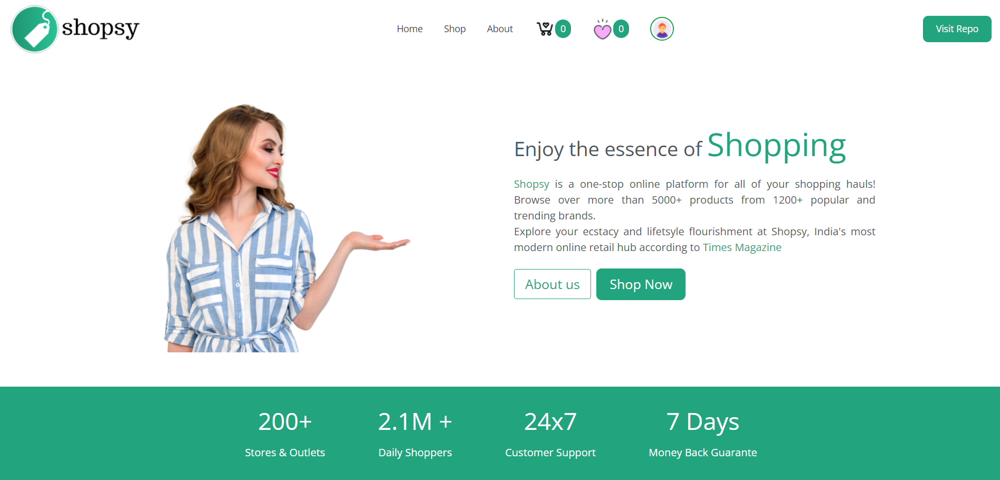
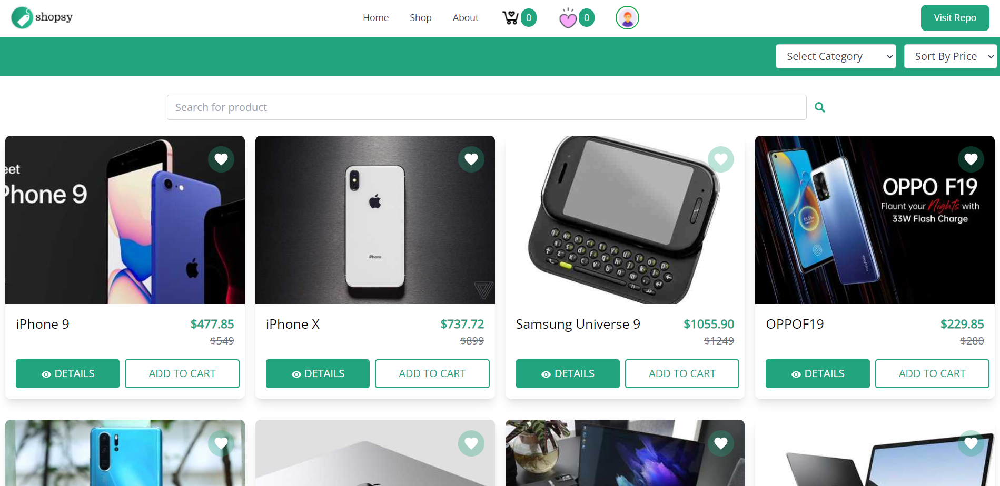
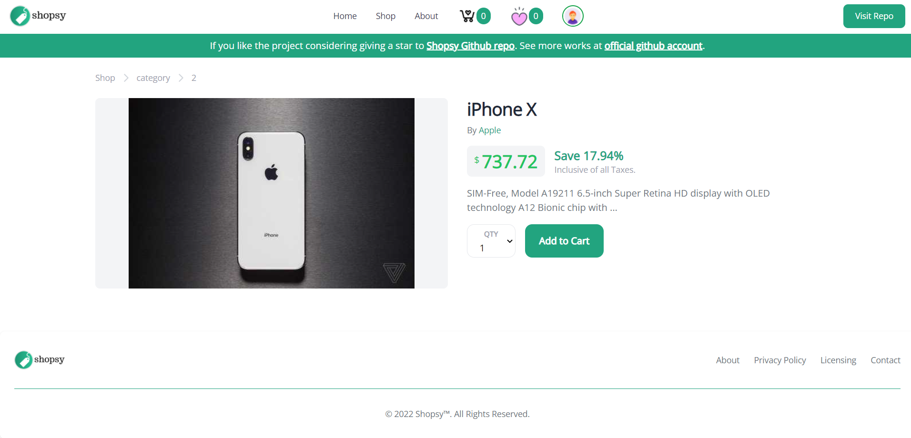
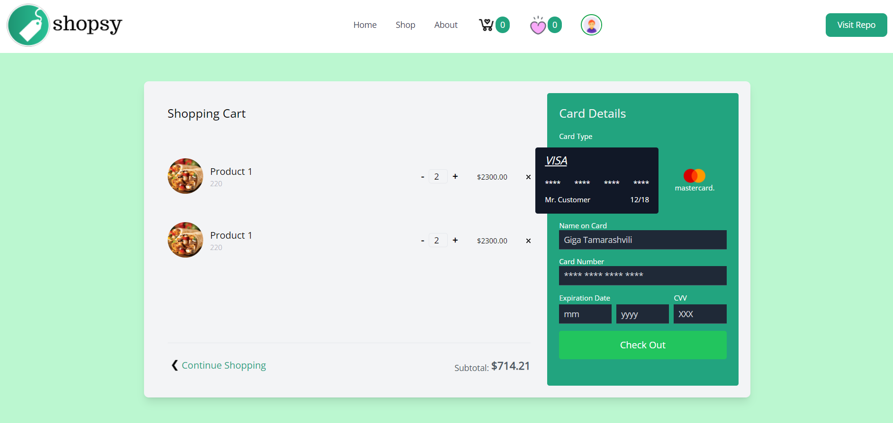
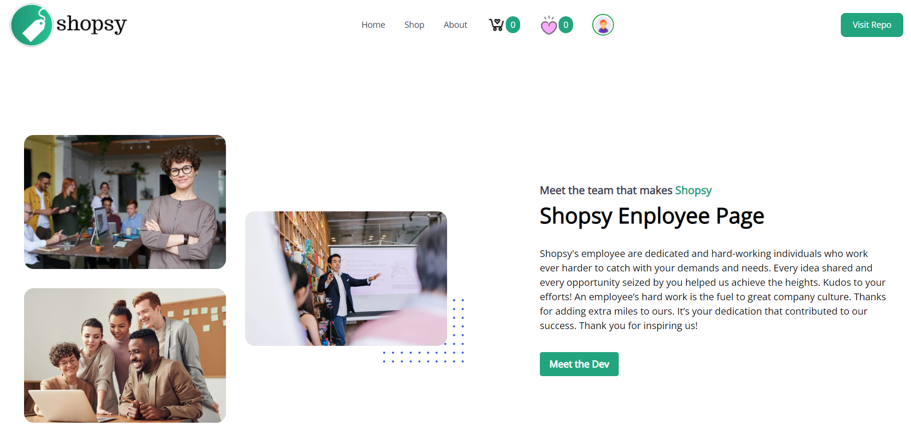

# Shopsy eCommerce React Application

  

## Introduction

Shopsy is a eCommerce application made using React and Redux. 

## Screenshots

home page

  

Shop page

  

Product Detail Page

  

Product Cart Page

  

About Page

  

## Technologies

- React.js
- Redux
- React-Redux
- Typescript
- React-Router-Dom

## Skills demonstrated

- Proficient in working with APIs
- Proficient in working with react-based technologies
- Efficient in creating single-page applications.

